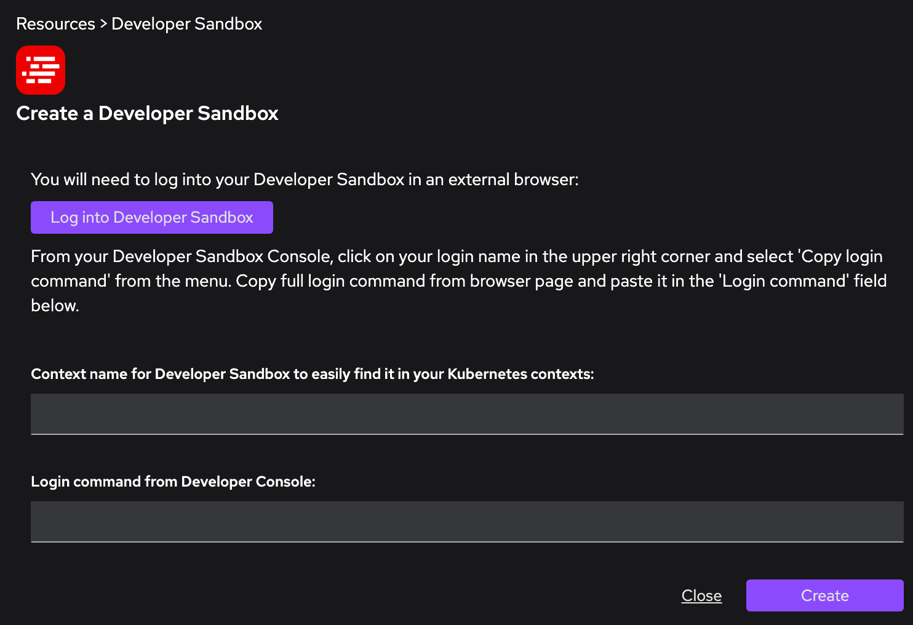
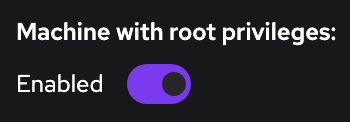
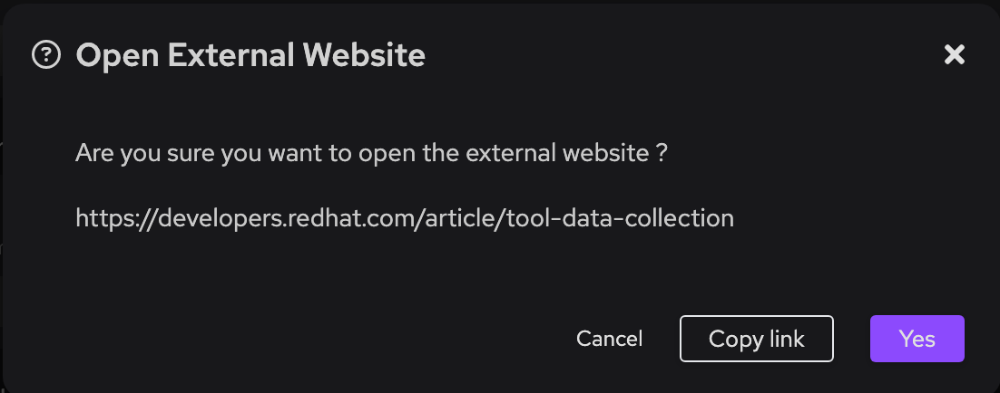

import ReactPlayer from 'react-player'

Podman Desktop 1.0 Release! 🎉

We still have many things planned, but with a little polish and a few more bug fixes we
felt we've reached a level of maturity and it is now time to declare our 1.0 release.

Thank you to everyone who has been with us on this journey so far! Please keep the
feedback coming!

<!--Main Features-->

- **Highlighting Featured Extensions**: Easily find and install new extensions.
- **Featured Extensions**: Two new extensions supporting OpenShift.
- **Podman Machine as Root**: Ability to run a Podman machine as root.
- **UX and UI Improvements**: Opening external websites, editing numbers, and tooltips.

Podman Desktop 1.0 is now available. [Click here to download it](/downloads)!

<!--truncate-->

---

## Release Details

### Highlighting Featured Extensions

A critical part of our vision for Podman Desktop is the ability to install extensions to
support additional container engines, Kubernetes providers, or other tools. However, it
has not been easy to discover new extensions.

With 1.0 we show a list of featured extensions in the **Welcome**
[#2354](https://github.com/containers/podman-desktop/pull/2354), the **Dashboard** and in
**<Icon icon="fa-solid fa-cog" size="lg" /> Settings > Extensions**
[#2355](https://github.com/containers/podman-desktop/pull/2355). Check out the new
extensions for **Red Hat OpenShift Local** and the **Developer Sandbox for Red Hat OpenShift**!

### Featured Extensions

Speaking of extensions, let's take a minute to turn the spotlight on these two!

Have another idea for extending Podman Desktop? We would love to hear from you or see
what you can create with the [Extension documentation](/docs/extensions),
and feature your extension here.

#### Red Hat OpenShift Local

OpenShift Local is a fully-featured single-node OpenShift cluster designed to run on your local computer.
With this extension you can install, start/stop, and deploy pods or YAML to OpenShift Local,
allowing you to test your applications on a full OpenShift environment, ensuring a consistent
experience between development, test, and production.

The recent addition of the MicroShift preset provides a lighter, optimized option that
starts faster and uses less resources for deployments that still want OpenShift compatibility
without the full set of OpenShift services.

#### Developer Sandbox for Red Hat OpenShift

The OpenShift Developer Sandbox is a free, cloud-based OpenShift environment that allows developers to
create, build, and deploy applications to OpenShift for 30 days. With this extension you can sign up
and easily deploy pods or YAML to a hosted OpenShift environment without a local installation or
leaving Podman Desktop.

### Podman Machine as Root

When creating a Podman machine you can now decide to run as root [#2427](https://github.com/containers/podman-desktop/pull/2427). This is a prerequisite for some scenarios, such as running Kind on Windows.

### Other UI and UX Improvements

#### Prompt to Open External Website

In the previous release links to external websites were blocked due to the security risk.
In 1.0 you can click to see the URL and have the option of opening or copying it
[#2414](https://github.com/containers/podman-desktop/pull/2414).

#### Editable Numeric Preferences

Tired of clicking +, +, +? Us too. Numeric preferences are now editable so
you can directly enter the value you want
[#2368](https://github.com/containers/podman-desktop/pull/2368).

#### Navigation tooltips

We like our new navigation bar, but the tooltips were slow to appear. This made it harder for new
users to discover the pages and for power users to see the container/pod/image counts. The
tooltips are now a little nicer and appear immediately
[#2286](https://github.com/containers/podman-desktop/pull/2286).

---

## Other Notable Enhancements

- If you use a non-default Podman machine you are now prompted to make it the default, so
  that command line tools will use the same machine [#2205](https://github.com/containers/podman-desktop/pull/2205).

- Extensions can now be installed without requiring a running local container engine
  [#2273](https://github.com/containers/podman-desktop/pull/2273).

- When extensions fail to load there is a new state (failed!) and an error message
  to help you fix or report the problem [#2424](https://github.com/containers/podman-desktop/pull/2424).

- The showInputBox API has support for Markdown [#2418](https://github.com/containers/podman-desktop/pull/2418).

---

## Notable Bug Fixes

- Fixed shared status when using multiple Podman 4.5 machines [#2441](https://github.com/containers/podman-desktop/pull/2441).
- Fixed hang on exit when telemetry is unreachable [#2431](https://github.com/containers/podman-desktop/pull/2431).
- Reduced initial Podman REST API calls to improve performance [#2419](https://github.com/containers/podman-desktop/pull/2419).
- **Play Kubernetes YAML** now honors the namespace [#2509](https://github.com/containers/podman-desktop/pull/2509).
- **Container** list was not remembering expand/collapsed status [#2491](https://github.com/containers/podman-desktop/pull/2491).
- Clear previous error when installing Docker extension [#2469](https://github.com/containers/podman-desktop/pull/2469).
- Ensure correct path with running Kind CLI [#2455](https://github.com/containers/podman-desktop/pull/2455).
- Use IPv4 over IPv6 by default [#2398](https://github.com/containers/podman-desktop/pull/2398).
- When changing the Kubernetes pod name, change the app name to match [#2389](https://github.com/containers/podman-desktop/pull/2389).
- Fixed incorrect pod status in **Containers** view [#2387](https://github.com/containers/podman-desktop/pull/2387).
- **Dashboard** wasn't correctly refreshing Podman status [#2359](https://github.com/containers/podman-desktop/pull/2359).

---

## Community Thank You

🎉 We’d like to say a big thank you to everyone who helped to make Podman Desktop even better. In this final
sprint we received pull requests from the following people:

- [Taha Attari](https://github.com/TahaAttari) in [#2470 - Update docker command in importing-saved-containers.md](https://github.com/containers/podman-desktop/pull/2470)
- [Jason Greene](https://github.com/n1hility) in [#2431 - Fix hang on exit when telemetry endpoint is unreachable](https://github.com/containers/podman-desktop/pull/2431)
- [Anders Björklund](https://github.com/afbjorklund) in [#2571 - Fix the location of the lima podman socket](https://github.com/containers/podman-desktop/pull/2571) and [#2572 - Fix the state of the lima container provider](https://github.com/containers/podman-desktop/pull/2572)
- [Tucker Chapman](https://github.com/tuckerrc) in [#2567 - Add example image name in placeholder](https://github.com/containers/podman-desktop/pull/2567)

There are now a total of 54 people (and two bots!) who have contributed PRs to Podman Desktop, and we'd
like to extend an extra thanks to all of those outside of the immediate development team who contributed
to get us here:

[afbjorklund](https://github.com/afbjorklund),
[alv67](https://github.com/alv67),
[anjannath](https://github.com/anjannath),
[ankanroy-code](https://github.com/ankanroy-code),
[arixmkii](https://github.com/arixmkii),
[cblecker](https://github.com/cblecker),
[cfergeau](https://github.com/cfergeau),
[chevdor](https://github.com/chevdor),
[chrisjsimpson](https://github.com/chrisjsimpson),
[cu8code](https://github.com/cu8code),
[doehyunbaek](https://github.com/doehyunbaek),
[dylanmtaylor](https://github.com/dylanmtaylor),
[eidottermihi](https://github.com/eidottermihi),
[elervik](https://github.com/elervik),
[emmanuelbernard](https://github.com/emmanuelbernard),
[evanfpearson](https://github.com/evanfpearson),
[gorkem](https://github.com/gorkem),
[idjohnson](https://github.com/idjohnson),
[imphil](https://github.com/imphil),
[iongion](https://github.com/iongion),
[jlosito](https://github.com/jlosito),
[KevinAtSesam](https://github.com/KevinAtSesam),
[lsm5](https://github.com/lsm5),
[Mitch9378](https://github.com/Mitch9378),
[n1hility](https://github.com/n1hility),
[osslate](https://github.com/osslate),
[PatentLobster](https://github.com/PatentLobster),
[pwright](https://github.com/pwright),
[rdwz](https://github.com/rdwz),
[redhatrises](https://github.com/redhatrises),
[rhatdan](https://github.com/rhatdan),
[RobotSail](https://github.com/RobotSail),
[rohit-rambade](https://github.com/rohit-rambade),
[rsvoboda](https://github.com/rsvoboda),
[sfrunza13](https://github.com/sfrunza13),
[shemanaev](https://github.com/shemanaev),
[sstosh](https://github.com/sstosh),
[stickster](https://github.com/stickster),
[TahaAttari](https://github.com/TahaAttari),
[ths83](https://github.com/ths83),
[Tony-Sol](https://github.com/Tony-Sol),
[tuckerrc](https://github.com/tuckerrc),
[ucomesdag](https://github.com/ucomesdag),
[xbabalov](https://github.com/xbabalov),
zezo2019.

---

## Final notes

The complete list of issues fixed in this release is available [here](https://github.com/containers/podman-desktop/issues?q=is%3Aclosed+milestone%3A1.0.0) and [here](https://github.com/containers/podman-desktop/issues?q=is%3Aclosed+milestone%3A1.0.1).

Get the latest release from the [Downloads](/downloads) section of the website and boost your development journey with Podman Desktop. Additionally, visit the [GitHub repository](https://github.com/containers/podman-desktop) and see how you can help us make Podman Desktop better.
